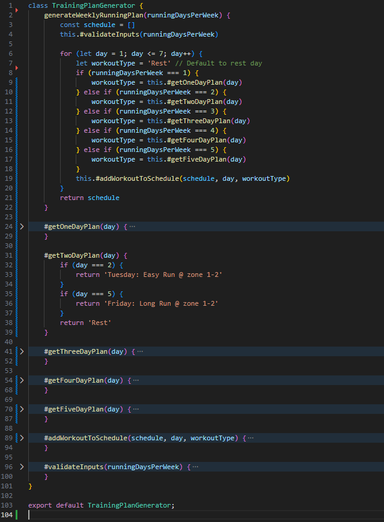

# Reflektion

## Namngivning (kapitel 2)

| Namn | Förklaring | Reflektion och regler från Clean Code |
|------|------------|---------------------------------------|
| FitnessAnalyzer.js | Klassnamn (var PulseCalculator) | Omdöpt från tidigare PulseCalculator, ju mer klassen växte desto mer otydligt blev det tidigare namnet. Det nya namnet beskriver bättre vad klassen faktiskt gör. För att **Avoid Disinformation** och istället **Use intention-Revealing Names** |
| createCompleteProfile() | Huvudmetod i FitnessAnalyzer | Metod som använder hjälpmetoder, namnbeskrivningen tycker jag är bra och beskrivande. Osäker på hur man ska tänka kring **Single Responsibility Principle** här, metoden gör ju en sak (av många andra saker). |
| calculateMaxPulse() | Hjälpmetod i FitnessAnalyzer | Hjälpmetod som har tydligt namn, dock är det inte optimalt att blanda pulse/heartrate, jag har även en metod som räknar ut vilopuls som heter calculateRestingHeartRate(). Borde hålla mig till ett val i hur jag beskriver. För att följa samma stil skulle denna kunna döpas om till calculateMaxHeartRate(). Jag har valt att behålla namnen för att delvis påminna mig själv hur rörigt det kan bli ibland och vikten av hur bra det är att vara tydlig och konsekvent i namngivningen. |
| generateWeeklyRunningPlan() | Metod i TrainingPlanGenerator | **Use intention-Revealing Names:** Bra namngivning som tydligt beskriver vad metoden gör. Namnet är ganska långt men jag tycker att det är försvarbart i och med hur tydligt det är. |
| calculatePace() | Metod i RunningCalculator | Tycker att dessa korta beräkningar har lite samma etikett, namnet beskriver tydligt vad dem gör men samtidigt inte. Svårt att veta hur man skulle göra om dessa. Med tanke på att metoders namn endast ska beskriva vad dem gör och inte hur. Parametrarna dessa har skvallrar ju dock om hur. Jag tycker att det krockar lite med **Use intention-Revealing Names** och **Avoid Disinformation**. En idé skulle vara att döpa om till calculatePaceFromDistanceAndTime(), å andra sidan beskriver den då både vad och hur den gör något. |

### Reflektion kapitel 2
Desto mer jag har reflekterat över namngivningar har jag märkt hur svårt det är att hitta namn som är både tydliga och bra. Pulse vs heartrate är ett bra exempel där jag borde valt en term och hållit mig till den men behöll dem som en påminnelse till mig själv. Jag har också insett att namn kan kännas tydliga och bra till en början. Men efterhand ju mer koden växer desto mer otydligt kan namnet bli. Ett exempel är PulseCalculator som till en början var ett bra namn på klassen, men ju mer den växte desto mindre tydligt blev namnet och fick bytas till FitnessAnalyzer.

Det är en svår balans eftersom jag tycker att det ofta blivit att jag övertänker valen av namn och ifrågasätter om det kanske finns ett ännu bättre namn. Lätt att fastna i ett letande efter det perfekta namnet som kanske egentligen inte existerar.

## Funktioner (kapitel 3)

| Metodnamn | Länk eller kod | Antal rader (ej ws) | Reflektion |
|-----------|----------------|---------------------|------------|
| generateWeeklyRunningPlan() | [TrainingPlanGenerator.js](../src/TrainingPlanGenerator.js) | 20 | Huvudmetoden följer nu **Do One Thing** genom att använda privata hjälpmetoder. Ursprungligen var denna metod 85+ rader och bröt mot flera Clean Code-principer, vilket ledde till refaktorering under laborationens gång. Före/efter-bilder på refaktoreringen finns i /img katalogen |
| createCompleteProfile() | [FitnessAnalyzer.js](../src/FitnessAnalyzer.js) | 17 | Namnet beskriver tydligt vad metoden gör och följer **Use Descriptive Names**. Bra exempel på hur man kan göra en tydlig huvudmetod som ändå följer **Do One Thing**. Den kombinerar hjälpmetoder för att skapa en komplett profil. |
| calculateRestingHeartRate() | [FitnessAnalyzer.js](../src/FitnessAnalyzer.js) | 11 | **Small:** Metoden är lagom lång med 11 rader och gör en sak. Den beräknar vilopuls baserat på ålder och aktivitetsnivå. **Function Arguments:** Dyadic med två argument vilket är okej eftersom båda behövs. De multipla if-satserna för activityLevel skulle möjligen kunna refaktoreras för att minska upprepning, men jag tycker de är tydliga och läsbara som de är nu. |
| calculatePulseZones() | [FitnessAnalyzer.js](../src/FitnessAnalyzer.js) | 11 | **Do One Thing:** Metoden gör bara en sak, skapar pulszoner baserat på maxpuls. **Don't Repeat Yourself:** Det finns repetition i Math.round(maxPulse * X) strukturen som skulle kunna brytas ut, men det skulle möjligtvis göra koden mindre läsbar. |
| predictRaceTime() | [RacePredictor.js](../src/RacePredictor.js) | 15 | Bra och tydligt namn tycker jag. **Do One Thing:** Metoden har många if-satser för olika distanser men gör ändå bara en sak vilket är att den förutsäger tid baserat på tidigare prestationer. |

### Reflektion kapitel 3
Den stora skillnaden mellan mina metoder är längden och komplexiteten. Ursprungligen stack generateWeeklyRunningPlan() ut som problematisk, men efter refaktorering följer den nu Clean Code-principerna bättre. Mina enklaste metoder som estimateVO2Max() är kort och tydlig.

Jag har en del funktioner som gör beräkningar där distans och fart räknas i kilometer, jag har inget som koverterar till miles vilket skulle vara något för vidareutveckling. Detta var något som jag inte tänkte alls på i början men att bara ha det begränsat till kilometer kan möjligvis begräna återanvändbarheten. 

En tydlig reflektion är insikten jag fick om att bryta ut funktioner och fördela ansvaret till mindre funktioner. Ett exempel är refaktoreringen jag gjorde i generateWeeklyRunningPlan(). Till en början såg den ut såhär: 

 

Och efter refaktoreringen såhär:

 

Med denna refaktorering tycker jag att jag tillämpade flera principer från Clean Code som **Do One Thing** och **Small Functions** 

# Reflektion över egen kodkvalitet
Jag tycker att kodkvaliteten är bra överlag och jag är nöjd med modulen. Det finns några metoder jag tror skulle kunna göras bättre ur ett Clean Code perspektiv. Däremot tycker jag att min kod har en bra readability och att koden är ganska talande och beskrivande i vad den gör. Jag har valt att inte kommentera speciellt mycket i min kod och istället fokuserat på **Self-Documenting Code**. Jag tycker inte heller att kommentarer skulle tillföra något större värde utan bara blir överflödigt. 

Jag kan även se att det finns förbättringsområden på en del ställen, exempelvis i calculateRestingHeartRate() där jag nästlat if-satser och upprepat kod en del. Men detta tror jag delvis också beror på brist på kunskap hos mig själv, alltså att jag förstår koden bättre som den är nu och därför behåller jag den så. Istället för att refaktorera till något som kanske är bättre i praktiken och enligt Clean Codes regler och filosofi men sämre för mig. Jag tycker jag uppfyllt flera koncept från kapitel 2 och 3. Speciellt **Meaningful Names** och **Self-Documenting Code**. 

Jag märkte en bit in i laborationen att mitt tankesätt blev väldigt riktat mot hur jag skulle vilja ha "den färdiga produkten" och det blev väldigt specifikt. I modulen bör exempelvis inte pulszoner ha en beskrivning, eller träningsplanen ha färdiga träningspass. Detta är något som programmeraren som använder modulen bör bestämma. Mina matematiska uträkningar i dessa funktioner är generella och beprövade så att alla kan använda dem, men beskrivningarna är exempelvis på engelska och redan där begränsar användningen till ett interface som är på engelska.

Ett tydligt exempel på att jag svävade iväg lite är funktionen `describePulseZones()` som returnerar hårdkodade engelska beskrivningar som "Very light activity, helps with recovery". En bättre design hade varit att bara returnera rådata (min/max puls) och låta användaren av modulen bestämma beskrivningar. Men i mitt fall låg tankarna på vad jag kanske skulle vilja använda det till i L3 senare. 

Från denna laborationen tar jag med mig att det är viktigt att tänka över dessa koncept när man skriver kod för att underlätta både för sig själv och andra som ska läsa eller använda koden. 