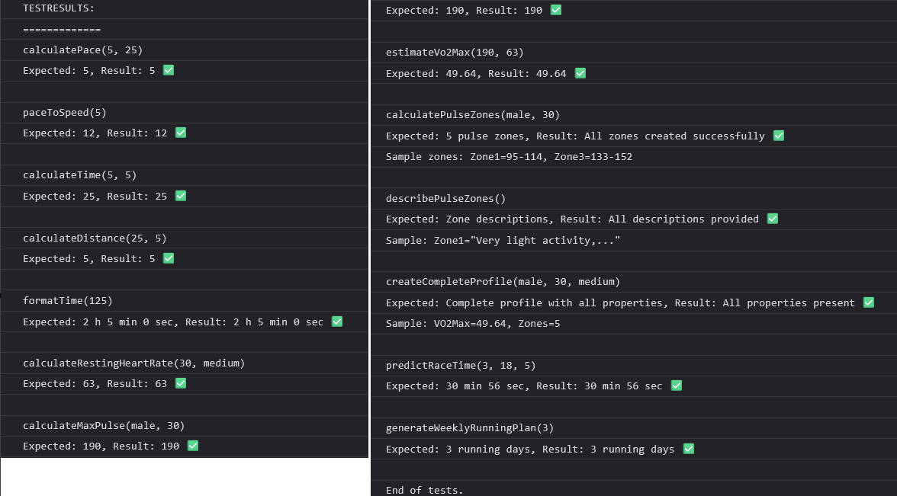

# Test Report

## Test Method
This module has been tested with an automated TestApp that runs all public methods and validates the results. Tests are executed in the browser via console output.

## Test Environment
- **Test app:** testapp.js
- **Platform:** Web browser (Chrome/Firefox)
- **Test type:** Functional tests of public interface

## Test Execution

Screenshot shows all tests executed with results in browser console

## Test Results

| What was tested | How it was tested | Test Result |
|-----------------|------------------|-------------|
| RunningCalculator.calculatePace() | Input: distance=5, time=25, expected output: 5 | PASS |
| RunningCalculator.paceToSpeed() | Input: pace=5, expected output: 12 | PASS |
| RunningCalculator.calculateTime() | Input: distance=5, pace=5, expected output: 25 | PASS |
| RunningCalculator.calculateDistance() | Input: time=25, pace=5, expected output: 5 | PASS |
| RunningCalculator.formatTime() | Input: 125 min, expected output: "2 h 5 min 0 sec" | PASS |
| FitnessAnalyzer.calculateRestingHeartRate() | Input: age=30, activity="medium", expected output: 63 | PASS |
| FitnessAnalyzer.calculateMaxPulse() | Input: gender="male", age=30, expected output: 190 | PASS |
| FitnessAnalyzer.estimateVo2Max() | Input: maxHR=190, restingHR=63, expected output: 49.64 | PASS |
| FitnessAnalyzer.calculatePulseZones() | Verifies that all 5 zones are created with min/max values | PASS |
| FitnessAnalyzer.describePulseZones() | Verifies that descriptions exist for all zones | PASS |
| FitnessAnalyzer.createCompleteProfile() | Creates complete profile, verifies all properties present | PASS |
| RacePredictor.predictRaceTime() | Input: 3km in 18min -> 5km, expected ~30min | PASS |
| TrainingPlanGenerator.generateWeeklyRunningPlan() | Input: 3 days/week, verifies 3 training days are created | PASS |

## Summary
**13/13 tests passed.** All public methods in the module function as expected. The tests cover:
- Basic calculations (pace, speed, time, distance)  
- Training analysis (pulse zones, VO2max, resting heart rate)
- Race time predictions
- Training plan generation